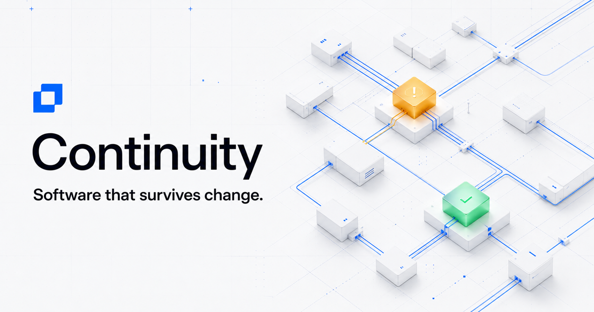
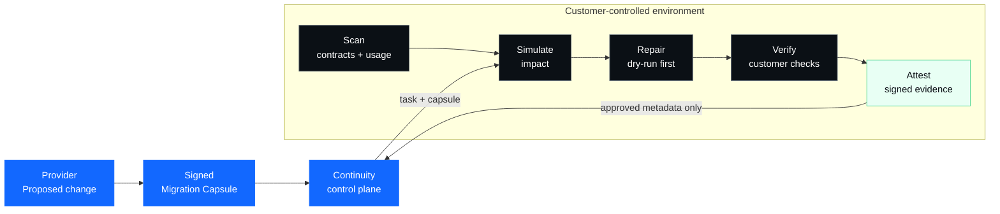

<div align="center">
  

  <h1>Continuity</h1>

  <p><strong>Software that survives change.</strong></p>

  <p>
    Predict what a software change will break.<br>
    Repair affected systems locally. Prove they are safe before release.
  </p>

  <p>
    <a href="https://continuity-eight.vercel.app/"><strong>Website</strong></a>
    ·
    <a href="PRD.md">Product requirements</a>
    ·
    <a href="ARCHITECTURE.md">Architecture</a>
    ·
    <a href="SECURITY.md">Security</a>
    ·
    <a href="ROADMAP.md">Roadmap</a>
  </p>

  <p>
    
    
    
    
    
  </p>
</div>

<br>



## Change should be testable before it becomes an incident

A provider changes an API, SDK, schema, authentication flow, or runtime
behavior. Documentation can describe the change, but it cannot tell every
consumer which call sites will fail or whether a migration actually works.

Continuity closes that loop:

```text
SCAN  →  SIMULATE  →  REPAIR  →  VERIFY  →  ATTEST
 map       predict      patch       prove       sign
```

The customer's source stays inside its own environment by default. Repairs are
reviewable, writes require authorization, and existing builds and tests—not a
model—decide whether the result is verified.

## The X-factor: a Counterfactual Change Network

Continuity is designed to test tomorrow's provider changes against today's
participating integrations without centralizing consumer source code.

| Provider side | Private network | Consumer side |
|---|---|---|
| Propose a `ChangeSet` | Route approved tasks and evidence | Execute against real code locally |
| Publish a signed Migration Capsule | Aggregate policy-approved outcomes | Repair inside the security boundary |
| Measure compatibility before release | Preserve unknown and blocked states | Verify with customer-owned checks |

The durable advantage is the network of provider changes, consumer
compatibility outcomes, signed migration logic, and independently verifiable
evidence—not a generic AI patch generator.

## How the system works



### Four product surfaces, one evidence model

| Surface | Purpose |
|---|---|
| **CLI** | Local scan, simulation, repair, verification, and evidence export |
| **MCP** | Permissioned change tools for compatible coding agents |
| **API / SDKs** | Provider changes, projects, capsules, simulations, and attestations |
| **Web console** | Change Twins, policies, approvals, usage, evidence, and deployment |

Native CI workflows integrate repository automation. There is no installed
source-control application.

## Run the end-to-end demonstration

### Requirements

- Rust toolchain with Cargo
- Node.js 22 or newer for the hosted and web packages
- Bash for the demonstration script

### One command

```bash
./scripts/demo.sh
```

The demonstration creates isolated TypeScript and Python consumer fixtures,
simulates one OpenAPI migration, previews the deterministic repair, requires
explicit approval before applying it, runs each consumer's checks, exports a
signed attestation, and verifies that evidence offline.

### Build the CLI

```bash
cargo build --release -p continuity
./target/release/continuity --help
```

### Core commands

```bash
continuity init
continuity scan
continuity simulate --change proposed-change.json
continuity repair --change proposed-change.json
continuity repair --change proposed-change.json --apply --approve
continuity verify
continuity export --change proposed-change.json
continuity attestation-verify .continuity/attestation.json
continuity mcp serve
```

`repair` is a dry run unless both `--apply` and `--approve` are supplied.

## Agent-native by design

The local STDIO MCP server exposes the same Rust engine as the CLI.

| Read or analyze | Write or verify |
|---|---|
| `scan_project` | `apply_repair` |
| `list_change_risks` | `verify_migration` |
| `simulate_change` | `get_attestation` |
| `propose_repair` | |

`apply_repair` fails unless the caller confirms that the dry run was reviewed
and the write was authorized.

```bash
continuity mcp serve
```

MCP resources use stable Continuity URIs such as:

```text
continuity://projects/current
continuity://projects/current/graph
continuity://changes/{id}
continuity://migrations/{id}
continuity://attestations/{id}
```

## Trust model

| Principle | Guarantee |
|---|---|
| **Local by default** | Source, secrets, and sensitive runtime data stay in the customer environment |
| **Deterministic first** | Signed recipes and deterministic transforms precede model-generated repair |
| **Human-authorized writes** | Agent-initiated repairs require dry-run review and explicit authorization |
| **Customer-owned truth** | Builds, tests, type checks, and policy determine verification |
| **Portable evidence** | Attestations can be verified without the hosted service |
| **Fail closed** | Invalid capsules and failed or partial checks never become verified |

Read the complete [security model](SECURITY.md) and
[architecture](ARCHITECTURE.md).

## Repository map

```text
continuity/
├── crates/continuity/    Rust engine, CLI, and local MCP server
├── fixtures/             TypeScript and Python migration consumers
├── changebench/          Reproducible evaluation cases
├── platform/             PostgreSQL-backed hosted control plane
├── web/                  Next.js marketing site and console
├── deploy/               Customer-controlled deployment examples
├── scripts/demo.sh       End-to-end local demonstration
└── *.md                  Product, security, business, and operating record
```

## Development

### Rust engine and CLI

```bash
cargo test --workspace
```

### Hosted control plane

```bash
cd platform
npm ci
npm test
```

### Web application

```bash
cd web
npm ci
npm test
```

The web application keeps scheduling disabled truthfully until
`NEXT_PUBLIC_CAL_LINK` is configured.

## Project status

The repository contains:

- a shared Rust engine and CLI;
- a local STDIO MCP server;
- a reproducible TypeScript and Python migration demonstration;
- deterministic repair and customer-owned verification;
- signed, offline-verifiable evidence;
- a PostgreSQL-backed hosted API foundation;
- an authenticated console foundation and native CI workflow;
- a multi-route Next.js marketing site;
- customer-controlled and disconnected-deployment foundations.

Production identity, billing, storage, signing, and scheduling accounts remain
external configuration. No customer, benchmark, certification, or performance
claim is published without evidence.

See [STATUS.md](STATUS.md) for the current work,
[LAUNCH_CHECKLIST.md](LAUNCH_CHECKLIST.md) for the remaining founder actions,
and [BRAND_GATE.md](BRAND_GATE.md) before any rename or public release.

## Documentation

| Document | Use it for |
|---|---|
| [PRD](PRD.md) | Authoritative product requirements and exclusions |
| [Architecture](ARCHITECTURE.md) | Components, trust boundaries, data flow, and deployment |
| [Security](SECURITY.md) | Threats, controls, privacy promises, and acceptance criteria |
| [Business](BUSINESS.md) | Customer ladder, monetization, distribution, and enterprise funnel |
| [Landing page](LANDING_PAGE.md) | Approved positioning, structure, and content rules |
| [Roadmap](ROADMAP.md) | Milestones and acceptance criteria |
| [Decision log](DECISIONS.md) | Locked product and engineering decisions |
| [Status](STATUS.md) | Completed work, blockers, and next tasks |
| [Handoff](HANDOFF.md) | Exact continuation protocol |
| [Brand gate](BRAND_GATE.md) | Required clearance before renaming or exporting the public core |
| [Sources](SOURCES.md) | Research and competitive references |
| [Agent instructions](AGENTS.md) | Binding rules for coding agents |

## Working name and release status

`Continuity` is a replaceable working name. Published CLI commands, packages,
APIs, MCP resources, and evidence formats require stable aliases if the brand
changes.

The repository remains private while the open-core boundary and public license
receive final review. Do not treat this repository as a released open-source
package yet.

---

<div align="center">
  <strong>Know before release. Repair before impact.</strong>
  <br><br>
  <a href="https://continuity-eight.vercel.app/">Explore Continuity</a>
  ·
  <a href="STATUS.md">See what is next</a>
</div>
